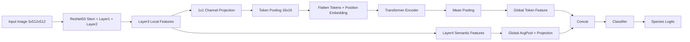

# AI护鲸使者：鲸类物种细粒度识别系统

本项目面向海洋鲸豚类图像识别场景，构建了一个从数据分析、模型训练、消融实验、可解释性分析到 ONNX Runtime + Flask Web 部署的完整 PyTorch 项目。核心任务是基于 Kaggle Happywhale 数据集进行鲸豚类物种分类，并针对复杂海况、类别长尾分布和演示系统可靠性做了工程化处理。

## 项目简介

项目目标不是简单判断“图里有没有鲸鱼”，而是识别“这是什么鲸类物种”。项目围绕 ResNet50 baseline 与 ResNet50-Transformer 混合架构展开系统对比：ResNet50 提取局部纹理，Transformer 建模鲸体不同部位之间的全局空间关联，并通过消融实验选择最终方案。

当前项目已包含：

- ResNet50 baseline 与 ResNet50-Transformer 对比实验，当前最终最佳研究模型为 `04_transformer_mean_focal_mixup_cutout`
- Focal Loss、Mixup、Cutout、EMA、Warmup + Cosine LR
- Macro F1、混淆矩阵、长尾分布分析、消融实验框架
- Group Split by `individual_id`，避免同一鲸鱼个体泄漏到训练集和验证集
- Grad-CAM 与 Transformer Attention Map 可解释性可视化
- ONNX Runtime 推理、模型 artifact 版本管理、Flask Web 演示系统
- 上传文件校验、低置信度不确定样本提示、Docker 容器化

## 项目结构

```text
AI鲸鱼/
  configs/                         # 配置模块，集中管理训练超参数和命令行参数
    config.py                      # TrainConfig 数据类、默认路径、模型/训练/增强配置
  data/                            # 数据读取、预处理和 DataLoader 构造
    dataset.py                     # WhaleSpeciesDataset、数据增强、Group Split、长尾划分工具
  models/                          # 模型结构定义
    resnet_baseline.py             # 纯 ResNet50 baseline，用于消融实验对比
    resnet_transformer.py          # ResNet50-Transformer 主模型，含 token pooling、多尺度融合、attention 捕获
  utils/                           # 通用训练工具
    losses.py                      # Focal Loss、Mixup、类别均衡 alpha 权重
    metrics.py                     # Macro F1、Accuracy、EMA、TensorBoard 日志工具
  tools/                           # 实验分析、评估、可解释性和部署转换脚本
    analyze_dataset.py             # 数据集长尾分析、训练/验证划分统计、类别 F1 和混淆对分析
    run_ablation.py                # 一键消融实验脚本，批量运行 baseline/增强/Transformer 对比
    generate_ablation_report.py    # 根据 ablation_results.csv 生成消融实验 Markdown 报告和柱状图
    organize_outputs.py            # 将散落报告/图片归档到 outputs/reports/archive_<时间>/
    eval_confusion_matrix.py       # 加载 checkpoint 绘制混淆矩阵
    generate_gradcam.py            # 生成 CNN Grad-CAM 可解释性热力图
    generate_attention_map.py      # 生成 Transformer Attention Map 可解释性热力图
    export_onnx.py                 # 导出 ONNX，并打包 artifact 模型版本目录
  deploy/                          # 推理部署代码
    onnx_inference.py              # ONNX Runtime 推理类，含图片预处理、Top-3 输出、低置信度判断
  whale_web/                       # Flask 本地 Web 演示系统
    app.py                         # Flask API 服务，负责图片上传校验、模型调用、REST 响应
    templates/index.html           # 单页前端界面，含拖拽上传、预览、Top-3 图表和不确定提示
  artifacts/                       # 模型版本管理目录
    README.md                      # artifact 目录规范与导出说明
  train.py                         # 主训练入口，控制训练、验证、保存最佳模型和实验指标
  train_resnet50_transformer.py    # 兼容旧入口，保留历史导入和旧运行方式
  requirements.txt                 # Python 依赖列表
  Dockerfile                       # Flask Web 服务容器化部署配置
```

## 数据集说明

数据集使用 Kaggle `Happywhale - Whale and Dolphin Identification` 的 512 像素宽度预处理版本。本项目当前做的是 `species` 物种分类，不是 `individual_id` 个体识别。

默认数据目录：

```text
archive/
  train.csv
  train_images/
  test_images/
```

`train.csv` 需要包含：

```text
image,species,individual_id
```

当前数据统计：

| 指标 | 数值 |
|---|---:|
| 总图像数 | 51033 |
| 合并拼写噪声后物种数 | 28 |
| 最大类别 | bottlenose_dolphin, 10781 |
| 最小类别 | frasiers_dolphin, 14 |
| 最大/最小类别样本比 | 770.1x |
| 类别样本中位数 | 459 |

项目会默认合并 Kaggle 中两个常见拼写噪声：

```text
bottlenose_dolpin -> bottlenose_dolphin
kiler_whale -> killer_whale
```

## 模型结构

核心模型类为 `ResNet50_Transformer`，支持 token pooling、多尺度融合和可解释性 attention 捕获。经过消融实验，当前最佳研究模型配置为：

```text
04_transformer_mean_focal_mixup_cutout
backbone_stage = layer3_layer4
token_pool_size = 16
transformer_pooling = mean
loss = focal
mixup = on
cutout = on
ema = off
```



模型类同时支持两种聚合方式：

```text
backbone_stage = layer3_layer4
token_pool_size = 16
transformer_pooling = mean / cls
```

含义：

- `layer3` 保留局部纹理细节，进入 Transformer。
- `token_pool_size=16` 将 32x32 token 降到 16x16，降低自注意力显存压力。
- `layer4` 提供高层语义，通过全局池化后与 Transformer 表征融合。
- `mean pooling` 对当前物种分类任务的 Macro F1 表现最好；`CLS Token` 仍保留在代码中，作为可选设计和消融对照。

## 环境安装

建议使用 Conda 环境：

```powershell
conda create -n whale python=3.12 -y
conda activate whale
pip install -r requirements.txt
```

如果只运行 Web ONNX 推理，至少需要：

```powershell
pip install flask pillow numpy onnxruntime
```

如果需要导出 ONNX：

```powershell
pip install onnx onnxruntime
```

## 版本控制说明

仓库默认只提交源码、配置、脚本、文档和轻量说明文件；原始数据集、训练输出、日志、模型权重和 ONNX artifact 不进入 Git。

首次拉取代码后需要自行准备：

```text
archive/train.csv
archive/train_images/
archive/test_images/
```

训练或导出后生成的内容会出现在 `outputs/`、`logs/`、`artifacts/` 等目录，这些目录已由 `.gitignore` 排除。若需要发布模型文件，建议通过 Release、对象存储或单独的模型仓库分发。

## 数据分析

生成长尾分布图、类别统计和无泄漏划分报告：

```powershell
python tools/analyze_dataset.py --output-dir outputs/analysis --split-strategy group
```

输出：

```text
outputs/analysis/species_count_bar.png
outputs/analysis/long_tail_distribution.png
outputs/analysis/species_counts.csv
outputs/analysis/train_val_split_stats.csv
outputs/analysis/split_leakage_report.json
outputs/analysis/dataset_summary.json
```

当前 Group Split 检查结果：

| 指标 | 数值 |
|---|---:|
| 训练样本数 | 40639 |
| 验证样本数 | 10394 |
| 训练 individual_id 数 | 12414 |
| 验证 individual_id 数 | 3173 |
| 训练/验证 individual_id 重叠数 | 0 |
| 是否无泄漏 | true |

## 训练命令

推荐先使用显存更稳的 batch size：

```powershell
python train.py --data-root archive --epochs 20 --batch-size 4 --backbone-stage layer3_layer4 --token-pool-size 16 --split-strategy group
```

显存不足时使用轻量版：

```powershell
python train.py --data-root archive --epochs 20 --batch-size 4 --backbone-stage layer4 --token-pool-size 16 --split-strategy group
```

关闭预训练权重做快速代码检查：

```powershell
python train.py --data-root archive --epochs 1 --batch-size 2 --image-size 128 --no-pretrained --backbone-stage layer4
```

训练产物：

```text
outputs/best_model.pth
outputs/class_to_idx.json
outputs/metrics.json
outputs/runs/
```

从当前版本开始，TensorBoard 日志会按实验名和时间戳自动分目录，例如：

```text
outputs/runs/transformer_cls_layer3_layer4_tp16_focal_mixup_cutout_ema_20260420-031500/
```

查看 TensorBoard：

```powershell
tensorboard --logdir outputs/runs
```

打开 TensorBoard 后，左侧 run 名就是对应实验名；如果是早期训练产生的旧日志，可能仍显示在 `outputs/runs` 根目录下。

## 消融实验

项目提供一键消融脚本：

```powershell
python tools/run_ablation.py --dry-run --epochs 20 --batch-size 4
```

确认命令后正式运行：

```powershell
python tools/run_ablation.py --run --epochs 20 --batch-size 4
```

只跑部分实验：

```powershell
python tools/run_ablation.py --run --epochs 3 --batch-size 4 --only 01_resnet50_ce_plain 06_transformer_cls_focal_mixup_cutout_ema
```

内置实验：

| 实验名 | 模型 | Loss | Mixup | Cutout | Transformer | CLS Token | EMA |
|---|---|---|---|---|---|---|---|
| 01_resnet50_ce_plain | ResNet50 | CE | 否 | 否 | 否 | 否 | 否 |
| 02_resnet50_focal_plain | ResNet50 | Focal | 否 | 否 | 否 | 否 | 否 |
| 03_resnet50_focal_mixup_cutout_ema | ResNet50 | Focal | 是 | 是 | 否 | 否 | 是 |
| 04_transformer_mean_focal_mixup_cutout | ResNet50-Transformer | Focal | 是 | 是 | 是 | 否 | 否 |
| 05_transformer_cls_focal_mixup_cutout | ResNet50-Transformer | Focal | 是 | 是 | 是 | 是 | 否 |
| 06_transformer_cls_focal_mixup_cutout_ema | ResNet50-Transformer | Focal | 是 | 是 | 是 | 是 | 是 |

消融结果会自动汇总到：

```text
outputs/ablations/ablation_results.csv
```

论文表格可以从这个 CSV 中提取 `best_val_acc` 和 `best_val_macro_f1`。

也可以一键生成 Markdown 报告和 Macro F1 柱状图：

```powershell
python tools/generate_ablation_report.py
```

默认输出：

```text
outputs/reports/ablation/ablation_report_<时间戳>.md
outputs/reports/ablation/ablation_macro_f1_<时间戳>.png
```

如果需要整理早期散落在 `outputs/` 根目录的报告和图片：

```powershell
python tools/organize_outputs.py
```

默认会复制到：

```text
outputs/reports/archive_<时间戳>/
```

## 评估命令

生成混淆矩阵：

```powershell
python tools/eval_confusion_matrix.py --checkpoint outputs/best_model.pth --normalize
```

未指定 `--output` 时，图片会自动保存到：

```text
outputs/reports/evaluation/confusion_matrix_<时间戳>.png
```

基于 checkpoint 生成各类别 F1 和最易混淆类别对：

```powershell
python tools/analyze_dataset.py --checkpoint outputs/best_model.pth --output-dir outputs/analysis
```

输出：

```text
outputs/analysis/per_class_metrics.csv
outputs/analysis/per_class_f1_bar.png
outputs/analysis/confusion_top_pairs.csv
outputs/analysis/confusion_top_pairs.png
```

## 可解释性可视化

Grad-CAM：

```powershell
python tools/generate_gradcam.py --image archive/train_images/xxx.jpg --checkpoint outputs/best_model.pth
```

Transformer Attention Map：

```powershell
python tools/generate_attention_map.py --image archive/train_images/xxx.jpg --checkpoint outputs/best_model.pth
```

未指定 `--output` 时，可解释性图片会自动保存到：

```text
outputs/reports/interpretability/gradcam_<时间戳>.jpg
outputs/reports/interpretability/attention_<时间戳>.jpg
```

答辩表述建议：

```text
Grad-CAM 用于观察 CNN 局部关注区域；
Transformer Attention Map 用于观察全局空间关联建模。
```

## ONNX 导出与模型版本管理

当前推荐的最终模型 artifact 为：

```text
artifacts/final_model_04
```

如果需要重新导出或覆盖该 artifact，可执行：

```powershell
python tools/export_onnx.py `
  --checkpoint outputs/reports/final_model_04/best_model.pth `
  --class-map outputs/reports/final_model_04/class_to_idx.json `
  --metrics outputs/reports/final_model_04/metrics.json `
  --artifact-dir artifacts/final_model_04 `
  --version v_final_04
```

生成：

```text
artifacts/final_model_04/
  model.onnx
  class_to_idx.json
  config.json
  metrics.json
  manifest.json
```

单张图片 ONNX 推理：

```powershell
python deploy/onnx_inference.py `
  --artifact-dir artifacts/final_model_04 `
  --image archive/train_images/xxx.jpg `
  --confidence-threshold 0.5
```

已验证样例：

```powershell
python deploy/onnx_inference.py --artifact-dir artifacts/final_model_04 --image archive/train_images/90f1655bca651f.jpg --confidence-threshold 0.5
```

输出摘要：

```text
Top-1: false_killer_whale
Confidence: 97.54%
Decision: accepted
Top-3:
  false_killer_whale 97.54%
  melon_headed_whale 2.10%
  blue_whale 0.13%
Runtime provider: CPUExecutionProvider
```

## Web 启动

启动 Flask：

```powershell
python whale_web/app.py
```

访问：

```text
http://127.0.0.1:5000
```

健康检查：

```text
http://127.0.0.1:5000/health
```

默认加载：

```text
artifacts/final_model_04
```

切换模型版本：

```powershell
$env:WHALE_ARTIFACT_DIR="artifacts/your_other_model_version"
python whale_web/app.py
```

调整低置信度阈值：

```powershell
$env:WHALE_CONFIDENCE_THRESHOLD="0.65"
python whale_web/app.py
```

Web 端已包含：

- 图片后缀校验：`.png`、`.jpg`、`.jpeg`
- 文件大小限制：10MB
- PIL 图片合法性校验
- 统一 REST 响应格式
- Top-3 置信度柱状图
- 低置信度“不确定，建议人工复核”提示

## Docker 部署

构建镜像：

```powershell
docker build -t whale-web .
```

运行容器：

```powershell
docker run --rm -p 5000:5000 whale-web
```

如果 artifact 不在镜像内，也可以挂载：

```powershell
docker run --rm -p 5000:5000 `
  -v ${PWD}/artifacts:/app/artifacts `
  whale-web
```

## 实验结果表格

当前仓库的消融实验已经跑完，结果来自：

```text
outputs/ablation_all_results/outputs/ablations/ablation_results.csv
```

| 实验 | Focal | Mixup | Cutout | Transformer | Pooling | EMA | Acc | Macro F1 |
|---|---|---|---|---|---|---|---:|---:|
| 01_resnet50_ce_plain | 否 | 否 | 否 | 否 | gap | 否 | 0.9815 | 0.9106 |
| 02_resnet50_focal_plain | 是 | 否 | 否 | 否 | gap | 否 | 0.9787 | 0.9058 |
| 03_resnet50_focal_mixup_cutout_ema | 是 | 是 | 是 | 否 | gap | 是 | 0.9769 | 0.9048 |
| 04_transformer_mean_focal_mixup_cutout | 是 | 是 | 是 | 是 | mean | 否 | 0.9794 | **0.9199** |
| 05_transformer_cls_focal_mixup_cutout | 是 | 是 | 是 | 是 | cls | 否 | 0.9778 | 0.9072 |
| 06_transformer_cls_focal_mixup_cutout_ema | 是 | 是 | 是 | 是 | cls | 是 | 0.9780 | 0.9022 |

结论：

- 如果以 `Accuracy` 为主，`01_resnet50_ce_plain` 最高，为 `0.9815`。
- 如果以长尾分类更关键的 `Macro F1` 为主，`04_transformer_mean_focal_mixup_cutout` 最优，为 `0.9199`。
- `CLS Token` 与 `EMA` 在当前任务设定下没有带来额外收益，因此不作为最终最佳模型配置。

最终最佳研究模型摘要：

```text
experiment_name: 04_transformer_mean_focal_mixup_cutout
best_epoch: 19 / 20
val_acc: 0.9794111988
val_macro_f1: 0.9199286851
split_strategy: Group Split by individual_id
train_size: 40639
val_size: 10394
num_classes: 28
checkpoint: outputs/ablation_all_results/outputs/ablations/04_transformer_mean_focal_mixup_cutout/best_model.pth
reports: outputs/reports/final_model_04/
artifact: artifacts/final_model_04
```

补充说明：

- `main_model_results_20260421-095623` 对应的是 `CLS + EMA` 版本，用于完整流程验证和报告链路测试。
- 当前 README 与部署推荐均以 `04_transformer_mean_focal_mixup_cutout` 作为最终最佳研究模型。

## 项目亮点

- 针对鲸类细粒度分类设计 ResNet50-Transformer 混合架构。
- 引入 Token Pooling，把 layer3 token 从 1024 降到 256，兼顾细节和显存。
- 融合 layer3 局部纹理与 layer4 全局语义，多尺度建模更适合细粒度识别。
- 通过完整消融实验发现 `mean pooling` 优于 `CLS Token + EMA`，最终模型选择由实验结果驱动而非预设假设。
- 使用 Focal Loss、Mixup、Cutout、EMA 等训练策略应对长尾数据和复杂海况，并量化它们的真实收益。
- 使用 Macro F1 作为核心保存指标，避免 Accuracy 被高频类别主导。
- 使用 Group Split by `individual_id` 防止同一鲸鱼个体泄漏到验证集。
- 提供完整消融实验、长尾分析、混淆矩阵、Grad-CAM 和 Attention Map。
- 支持 ONNX Runtime、模型 artifact 版本管理、Flask Web 演示和 Docker 部署。
- Web 服务包含文件校验、全局异常处理和低置信度不确定样本提示。

## 不足与改进方向

- 当前主要做 `species` 物种分类，还没有扩展到 `individual_id` 个体重识别。
- Kaggle test_images 没有物种真值，不能直接作为独立测试集计算 Macro F1。
- 低置信度阈值目前基于最大 softmax 概率，后续可以加入温度校准、能量分数或 OOD 检测。
- Web 当前是本地演示系统，生产部署还可以加入 Gunicorn、请求日志、模型热更新和访问鉴权。
- 未来可加入 YOLO 作为前置鲸体检测模块，再将裁剪区域送入分类模型。

## 简历表述参考

```text
构建鲸类物种细粒度识别系统，基于 Happywhale 数据集完成 ResNet50 与 ResNet50-Transformer 的系统消融对比；采用 individual_id Group Split 防止验证泄漏，以 Macro F1 评估 770x 长尾分布下的类别表现，最终确定 `04_transformer_mean_focal_mixup_cutout` 为最佳研究模型；实现长尾分析、混淆矩阵、Grad-CAM、Attention Map、ONNX Runtime 模型版本化部署与 Flask 可视化演示平台。
```
