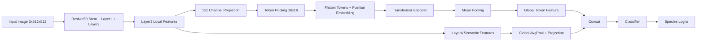

# AI护鲸使者：鲸类物种细粒度识别系统

本项目面向海洋鲸豚类图像识别场景，构建了一个从数据分析、模型训练、消融实验、可解释性分析到 ONNX Runtime + Flask Web 部署的完整 PyTorch 项目。核心任务是基于 Kaggle Happywhale 数据集进行鲸豚类物种分类，并针对复杂海况、类别长尾分布和推理服务可靠性做了工程化处理。

## 项目简介

项目目标不是简单判断“图里有没有鲸鱼”，而是识别“这是什么鲸类物种”。项目围绕 ResNet50 baseline 与 ResNet50-Transformer 混合架构展开系统对比：ResNet50 提取局部纹理，Transformer 建模鲸体不同部位之间的全局空间关联，并通过消融实验选择最终方案。

当前项目已包含：

- ResNet50 baseline、ResNet50-Transformer 与 GeM/Sub-center ArcFace metric 模型
- 已完成 17 组同划分受控实验；当前单模型为 `07_previous_best_transformer_recipe`，最佳结果为验证集锁定的四模型概率集成，独立测试 Accuracy `98.43%`、Macro F1 `92.60%`
- Focal Loss、Mixup、Cutout、EMA、Warmup + Cosine LR
- Macro F1、混淆矩阵、长尾分布分析、消融实验框架
- Group Split by `individual_id`，避免同一鲸鱼个体泄漏到训练集和验证集
- Grad-CAM 与 Transformer Attention Map 可解释性可视化
- ONNX Runtime 推理、模型 artifact 版本管理、Flask Web 推理服务
- 上传文件校验、低置信度不确定样本提示、Docker 容器化

## 项目结构

```text
AI鲸鱼/
  configs/                         # 配置模块，集中管理训练超参数和命令行参数
    config.py                      # TrainConfig 数据类、默认路径、模型/训练/增强配置
  data/                            # 数据读取、预处理和 DataLoader 构造
    dataset.py                     # WhaleSpeciesDataset、数据增强、Group Split、长尾划分工具
  models/                          # 模型结构定义
    resnet_baseline.py             # 纯 ResNet50 baseline，用于消融实验对比
    resnet_transformer.py          # ResNet50-Transformer 主模型，含 token pooling、多尺度融合、attention 捕获
    resnet_metric.py               # ResNet50 + GeM + Linear/Sub-center ArcFace
    factory.py                     # 训练、评估、可解释性、ONNX 共用的模型构造入口
  utils/                           # 通用训练工具
    losses.py                      # Focal Loss、Mixup、类别均衡 alpha 权重
    metrics.py                     # Macro F1、Accuracy、EMA、TensorBoard 日志工具
  tools/                           # 实验分析、评估、可解释性和部署转换脚本
    analyze_dataset.py             # 数据集长尾分析、训练/验证划分统计、类别 F1 和混淆对分析
    run_ablation.py                # 一键消融实验脚本，批量运行 baseline/增强/Transformer 对比
    generate_ablation_report.py    # 根据 ablation_results.csv 生成消融实验 Markdown 报告和柱状图
    select_best_experiment.py      # 只按多种子验证 Macro F1 选择模型族
    generate_model_report.py       # 固定独立测试集完整指标、置信区间、错误样本与校准报告
    organize_outputs.py            # 将散落报告/图片归档到 outputs/reports/archive_<时间>/
    eval_confusion_matrix.py       # 加载 checkpoint 绘制混淆矩阵
    generate_gradcam.py            # 生成 CNN Grad-CAM 可解释性热力图
    generate_attention_map.py      # 生成 Transformer Attention Map 可解释性热力图
    export_onnx.py                 # 导出 ONNX，并打包 artifact 模型版本目录
  deploy/                          # 推理部署代码
    onnx_inference.py              # ONNX Runtime 推理类，含图片预处理、Top-3 输出、低置信度判断
  whale_web/                       # Flask 本地 Web 推理服务
    app.py                         # Flask API 服务，负责图片上传校验、模型调用、REST 响应
    templates/index.html           # 单页前端界面，含拖拽上传、预览、Top-3 图表和不确定提示
  artifacts/                       # 模型版本管理目录
    README.md                      # artifact 目录规范与导出说明
  train.py                         # 主训练入口，控制训练、验证、保存最佳模型和实验指标
  train_resnet50_transformer.py    # 兼容旧入口，保留历史导入和旧运行方式
  requirements.txt                 # Python 依赖列表
  Dockerfile                       # Flask Web 服务容器化部署配置
```

## 数据集说明

数据集使用 Kaggle `Happywhale - Whale and Dolphin Identification` 的 512 像素宽度预处理版本。本项目当前做的是 `species` 物种分类，不是 `individual_id` 个体识别。

默认数据目录：

```text
archive/
  train.csv
  train_images/
  test_images/
```

`train.csv` 需要包含：

```text
image,species,individual_id
```

当前数据统计：

| 指标 | 数值 |
|---|---:|
| 总图像数 | 51033 |
| 合并拼写噪声后物种数 | 28 |
| 最大类别 | bottlenose_dolphin, 10781 |
| 最小类别 | frasiers_dolphin, 14 |
| 最大/最小类别样本比 | 770.1x |
| 类别样本中位数 | 459 |

项目会默认合并 Kaggle 中两个常见拼写噪声：

```text
bottlenose_dolpin -> bottlenose_dolphin
kiler_whale -> killer_whale
```

## 模型结构

核心模型类为 `ResNet50_Transformer`，支持 token pooling、多尺度融合和可解释性 attention 捕获。当前部署单模型配置为：

```text
07_previous_best_transformer_recipe
backbone_stage = layer3_layer4
token_pool_size = 16
transformer_pooling = mean
loss = focal
mixup = on
cutout = on
ema = off
```


```mermaid
flowchart LR
    A[Input Image 3x512x512] --> B[ResNet50 Stem + Layer1 + Layer2]
    B --> C[Layer3 Local Features]
    C --> D[1x1 Channel Projection]
    D --> E[Token Pooling 16x16]
    E --> F[Flatten Tokens + Position Embedding]
    F --> G[Transformer Encoder]
    G --> H[Mean Pooling]
    H --> I[Global Token Feature]

    C --> J[Layer4 Semantic Features]
    J --> K[Global AvgPool + Projection]

    I --> L[Concat]
    K --> L
    L --> M[Classifier]
    M --> N[Species Logits]
```

模型类同时支持两种聚合方式：

```text
backbone_stage = layer3_layer4
token_pool_size = 16
transformer_pooling = mean / cls
```

含义：

- `layer3` 保留局部纹理细节，进入 Transformer。
- `token_pool_size=16` 将 32x32 token 降到 16x16，降低自注意力显存压力。
- `layer4` 提供高层语义，通过全局池化后与 Transformer 表征融合。
- `mean pooling` 对当前物种分类任务的 Macro F1 表现最好；`CLS Token` 仍保留在代码中，作为可选设计和消融对照。

## 环境安装

建议使用 Conda 环境：

```powershell
conda create -n whale python=3.12 -y
conda activate whale
pip install -r requirements.txt
```

如果只运行 Web ONNX 推理，至少需要：

```powershell
pip install flask pillow numpy onnxruntime
```

如果需要导出 ONNX：

```powershell
pip install onnx onnxruntime
```

## 版本控制说明

仓库默认只提交源码、配置、脚本、文档和轻量说明文件；原始数据集、训练输出、日志、模型权重和 ONNX artifact 不进入 Git。

首次拉取代码后需要自行准备：

```text
archive/train.csv
archive/train_images/
archive/test_images/
```

训练或导出后生成的内容会出现在 `outputs/`、`logs/`、`artifacts/` 等目录，这些目录已由 `.gitignore` 排除。若需要发布模型文件，建议通过 Release、对象存储或单独的模型仓库分发。

## 数据分析

生成长尾分布图、类别统计和无泄漏划分报告：

```powershell
python tools/analyze_dataset.py --output-dir outputs/analysis --split-strategy group
```

输出：

```text
outputs/analysis/species_count_bar.png
outputs/analysis/long_tail_distribution.png
outputs/analysis/species_counts.csv
outputs/analysis/train_val_split_stats.csv
outputs/analysis/split_leakage_report.json
outputs/analysis/dataset_summary.json
```

历史两路 Group Split 检查结果：

| 指标 | 数值 |
|---|---:|
| 训练样本数 | 40639 |
| 验证样本数 | 10394 |
| 训练 individual_id 数 | 12414 |
| 验证 individual_id 数 | 3173 |
| 训练/验证 individual_id 重叠数 | 0 |
| 是否无泄漏 | true |

## 训练命令

推荐先使用显存更稳的 batch size。当前默认按 `individual_id` 固定划分约 80% train、10% validation、10% independent test（按完整个体分配，实际图片比例会略有偏差）：

```powershell
python train.py --data-root archive --epochs 20 --batch-size 4 --backbone-stage layer3_layer4 --token-pool-size 16 --split-strategy group --split-seed 42 --seed 42 --deterministic
```

显存不足时使用轻量版：

```powershell
python train.py --data-root archive --epochs 20 --batch-size 4 --backbone-stage layer4 --token-pool-size 16 --split-strategy group
```

关闭预训练权重做快速代码检查：

```powershell
python train.py --data-root archive --epochs 1 --batch-size 2 --image-size 128 --no-pretrained --backbone-stage layer4
```

训练产物：

```text
outputs/best_model.pth
outputs/class_to_idx.json
outputs/metrics.json
outputs/splits/train.csv
outputs/splits/val.csv
outputs/splits/test.csv
outputs/splits/split_summary.json
outputs/runs/
```

训练只用 validation Macro F1 选择 checkpoint；`train.py` 不读取独立测试集指标。最终测试必须使用 `tools/generate_model_report.py` 单独执行。

## AutoDL 一键训练与报告

把数据放在 `archive/train.csv` 与 `archive/train_images/` 后执行：

```bash
bash scripts/autodl_run_research_pipeline.sh
```

该脚本会完成 GPU/数据检查、受控消融、验证集选模、独立测试、group bootstrap 置信区间、每类/头尾指标、错误样本、混淆矩阵、置信度校准、Grad-CAM/Attention、ONNX artifact、日志与压缩包生成。测试集不会参与选模。

AutoDL 脚本安装 `requirements-autodl.txt`，不会覆盖镜像中与 CUDA 匹配的 PyTorch；启动时会先验证 `torch.cuda.is_available()`，并把完整 `pip freeze` 保存到运行包。

当前受控消融使用一个训练随机种子；若需要论文级稳定性统计，可在保持数据划分不变的条件下补跑三个训练随机种子：

```bash
SEEDS="42 123 3407" EPOCHS=20 BATCH_SIZE=8 NUM_WORKERS=8 \
  bash scripts/autodl_run_research_pipeline.sh
```

已经完成受控消融时，不需要重新训练。可复用 02/04/06/07 检查点，在固定验证集上锁定概率集成与水平翻转 TTA，再只评估一次独立测试集：

```bash
RUN_ROOT=outputs/autodl_research_20260909-023128 \
  bash scripts/autodl_run_fast_ensemble.sh
```

结果写入 `RUN_ROOT/reports/fast_ensemble/`，包含验证权重搜索表、锁定方案、独立测试指标、逐类指标、错误样本、混淆矩阵与置信度图。这个步骤不训练模型，也不会使用测试集搜索权重。

只跑历史最佳 Transformer 配方及完整报告链路：

```bash
bash scripts/autodl_run_main_model.sh
```

最终完整消融结果见 [reports/ablation_final_20260910.md](reports/ablation_final_20260910.md)。

从当前版本开始，TensorBoard 日志会按实验名和时间戳自动分目录，例如：

```text
outputs/runs/transformer_cls_layer3_layer4_tp16_focal_mixup_cutout_ema_20260420-031500/
```

查看 TensorBoard：

```powershell
tensorboard --logdir outputs/runs
```

打开 TensorBoard 后，左侧 run 名就是对应实验名；如果是早期训练产生的旧日志，可能仍显示在 `outputs/runs` 根目录下。

## 消融实验

项目默认提供新的受控消融套件：

```powershell
python tools/run_ablation.py --dry-run --suite controlled --epochs 20 --batch-size 4
```

确认命令后正式运行：

```powershell
python tools/run_ablation.py --run --suite controlled --epochs 20 --batch-size 4 --seeds 42 123 3407 --deterministic
```

只跑部分实验：

```powershell
python tools/run_ablation.py --run --suite controlled --epochs 3 --batch-size 4 --only 01_resnet50_ce_resize 05_metric_arcface_gem_crop
```

受控实验：

| 实验名 | 主要变化 | 目的 |
|---|---|---|
| 01_resnet50_ce_resize | ResNet50 + CE | 新基线 |
| 02_resnet50_ce_crop | + RandomResizedCrop | 检验背景/填充依赖 |
| 03_metric_linear_gap_crop | embedding + Linear + GAP | metric 结构对照 |
| 04_metric_linear_gem_crop | GAP → GeM | 单独检验 GeM |
| 05_metric_arcface_gem_crop | Linear → Sub-center ArcFace | 单独检验 ArcFace |
| 06_transformer_mean_ce_crop | ResNet50 → Transformer mean | 检验全局关系建模 |
| 07_previous_best_transformer_recipe | 历史 Focal/Mixup/Cutout 配方 | 与旧实验对接 |
| 08_transformer_ce_mixup_cutout | Focal → CE | 单独检验 Focal |
| 09_transformer_focal_nomixup_cutout | 关闭 Mixup | 单独检验 Mixup |
| 10_transformer_focal_mixup_nocutout | 关闭 Cutout | 单独检验 Cutout |
| 11_transformer_focal_mixup_cutout_crop | Resize → RandomResizedCrop | 检验裁剪尺度 |
| 12_transformer_focal_mixup_cutout_token8 | Token Pool 16 → 8 | 检验 token 数量下界 |
| 13_transformer_focal_mixup_cutout_token24 | Token Pool 16 → 24 | 检验 token 数量上界 |
| 14_transformer_focal_mixup_cutout_layer3 | layer3+layer4 → layer3 | 检验多尺度融合 |
| 15_transformer_focal_mixup_cutout_dropout02 | Dropout 0.1 → 0.2 | 检验正则强度 |
| 16_transformer_focal_mixup_cutout_freeze2 | 前 2 epoch 冻结 backbone | 检验冻结策略 |
| 17_transformer_focal_mixup_cutout_image384 | 输入 512 → 384 | 检验输入分辨率 |

原 6 组实验仍可用 `--suite legacy` 复现。

消融结果会自动汇总到：

```text
outputs/ablations/ablation_results.csv
```

论文表格可以从这个 CSV 中提取 `best_val_acc` 和 `best_val_macro_f1`。

也可以一键生成 Markdown 报告和 Macro F1 柱状图：

```powershell
python tools/generate_ablation_report.py
```

默认输出：

```text
outputs/reports/ablation/ablation_report_<时间戳>.md
outputs/reports/ablation/ablation_macro_f1_<时间戳>.png
```

如果需要整理早期散落在 `outputs/` 根目录的报告和图片：

```powershell
python tools/organize_outputs.py
```

默认会复制到：

```text
outputs/reports/archive_<时间戳>/
```

## 评估命令

生成混淆矩阵：

```powershell
python tools/eval_confusion_matrix.py --checkpoint outputs/best_model.pth --normalize
```

未指定 `--output` 时，图片会自动保存到：

```text
outputs/reports/evaluation/confusion_matrix_<时间戳>.png
```

基于 checkpoint 生成各类别 F1 和最易混淆类别对：

```powershell
python tools/analyze_dataset.py --checkpoint outputs/best_model.pth --output-dir outputs/analysis
```

输出：

```text
outputs/analysis/per_class_metrics.csv
outputs/analysis/per_class_f1_bar.png
outputs/analysis/confusion_top_pairs.csv
outputs/analysis/confusion_top_pairs.png
```

## 可解释性可视化

Grad-CAM：

```powershell
python tools/generate_gradcam.py --image archive/train_images/xxx.jpg --checkpoint outputs/best_model.pth
```

Transformer Attention Map：

```powershell
python tools/generate_attention_map.py --image archive/train_images/xxx.jpg --checkpoint outputs/best_model.pth
```

未指定 `--output` 时，可解释性图片会自动保存到：

```text
outputs/reports/interpretability/gradcam_<时间戳>.jpg
outputs/reports/interpretability/attention_<时间戳>.jpg
```

Grad-CAM 用于观察 CNN 局部关注区域，Transformer Attention Map 用于观察全局空间关联建模。

## ONNX 导出与模型版本管理

当前推荐的默认 Flask artifact 为四模型集成；若集成目录不存在，服务自动回退到最佳单模型 07：

```text
artifacts/final_ensemble_07
artifacts/final_model_07
```

Flask 会先查找 `ensemble_manifest.json` 及四个独立 ONNX 组件；如果集成加载失败，再搜索 `artifacts/final_model_07` 或 AutoDL 运行目录中的 07 artifact。可分别通过 `WHALE_ENSEMBLE_ARTIFACT_DIR`、`WHALE_ARTIFACT_DIR` 和 `WHALE_USE_ENSEMBLE` 控制加载策略。

如果需要重新导出或覆盖该 artifact，可执行：

```powershell
python tools/export_onnx.py `
  --checkpoint outputs/reports/final_model_07/best_model.pth `
  --class-map outputs/reports/final_model_07/class_to_idx.json `
  --metrics outputs/reports/final_model_07/metrics.json `
  --artifact-dir artifacts/final_model_07 `
  --version v_final_07
```

生成：

```text
artifacts/final_model_07/
  model.onnx
  class_to_idx.json
  config.json
  metrics.json
  manifest.json
  onnx_validation.json
```

单张图片 ONNX 推理：

```powershell
python deploy/onnx_inference.py `
  --artifact-dir artifacts/final_model_07 `
  --image archive/train_images/xxx.jpg `
  --confidence-threshold 0.5
```

已验证样例：

```powershell
python deploy/onnx_inference.py --artifact-dir artifacts/final_model_07 --image archive/train_images/90f1655bca651f.jpg --confidence-threshold 0.5
```

输出摘要：

```text
Top-1: false_killer_whale
Confidence: 95.88%
Decision: accepted
Top-3:
  false_killer_whale 95.88%
  melon_headed_whale 2.10%
  blue_whale 0.13%
Runtime provider: CPUExecutionProvider
```

## Web 启动

启动 Flask：

```powershell
python whale_web/app.py
```

访问：

```text
http://127.0.0.1:5000
```

健康检查：

```text
http://127.0.0.1:5000/health
```

默认加载：

```text
artifacts/final_ensemble_07（不可用时回退到 final_model_07 或 AutoDL 07 artifact）
```

切换模型版本：

```powershell
$env:WHALE_ARTIFACT_DIR="artifacts/your_other_model_version"
python whale_web/app.py
```

调整低置信度阈值：

```powershell
$env:WHALE_CONFIDENCE_THRESHOLD="0.65"
python whale_web/app.py
```

Web 端已包含：

- 图片后缀校验：`.png`、`.jpg`、`.jpeg`
- 文件大小限制：10MB
- PIL 图片合法性校验
- 统一 REST 响应格式
- Top-3 置信度柱状图
- 低置信度“不确定，建议人工复核”提示

## Docker 部署

构建镜像：

```powershell
docker build -t whale-web .
```

运行容器：

```powershell
docker run --rm -p 5000:5000 whale-web
```

如果 artifact 不在镜像内，也可以挂载：

```powershell
docker run --rm -p 5000:5000 `
  -v ${PWD}/artifacts:/app/artifacts `
  whale-web
```

## 当前研究结果

受控实验统一使用 `individual_id` Group Split：训练集 40,277 张、验证集 5,409 张、独立测试集 5,347 张，三个集合之间个体重叠均为 0。训练和选模阶段不读取独立测试集。

01–17 共 17 组预设消融已全部完成。新增 08–17 均以 07 为单变量基准；其中最好的 15 为验证 Accuracy 97.82%、Macro F1 93.81%，仍未超过 07 的 98.23% / 94.87%，因此最佳单模型不变。

| 模型 | 验证 Accuracy | 验证 Macro F1 | 独立测试 Accuracy | 独立测试 Macro F1 |
|---|---:|---:|---:|---:|
| 07 单模型 | 98.23% | 94.87% | 97.51% | 90.99% |
| 验证集锁定四模型概率集成 | **98.63%** | **96.36%** | **98.43%** | **92.60%** |
| 08–17 最佳新增单模型 15（未选用） | 97.82% | 93.81% | — | — |
| 新集成候选 02/04/07/14（未采纳） | 98.56% | 96.61% | 98.20% | 92.26% |

集成候选为 02 ResNet50、04 ResNet50 + GeM、06 ResNet50-Transformer CE 和 07 最佳单模型。权重以验证 Macro F1 搜索，最终锁定为 `0.1 / 0.1 / 0.1 / 0.7`，水平翻转 TTA 未被选中。相对 07 单模型，独立测试错误数由 133 降至 84，Accuracy 提升 0.92 个百分点，Macro F1 提升 1.61 个百分点。

把十个新增 checkpoint 加入验证候选后，最多四模型的搜索选择 `02/04/07/14 = 0.1/0.1/0.6/0.2`，验证 Macro F1 增加 0.25 个百分点，但同条件独立测试 Macro F1 从 92.59% 降至 92.26%，错误数增加 11 张。该验证增益没有泛化，因此不更新部署权重，也不根据测试结果继续调参。

Flask 默认优先加载原 02/04/06/07 四模型 ONNX 集成，缺失时回退到 07 单模型。旧划分上的历史最佳验证 Macro F1 为 91.99%，不能与当前独立测试结果直接比较。完整消融表、单变量结论和新增集成复核见 [reports/ablation_final_20260910.md](reports/ablation_final_20260910.md)。

## 技术特性

- 针对鲸类细粒度分类设计 ResNet50-Transformer 混合架构。
- 引入 Token Pooling，把 layer3 token 从 1024 降到 256，兼顾细节和显存。
- 融合 layer3 局部纹理与 layer4 全局语义，多尺度建模更适合细粒度识别。
- 通过 17 组固定划分实验量化裁剪、GeM、ArcFace、多尺度融合、Focal、Mixup、Cutout、token 数量、Dropout、冻结策略和输入分辨率，最终模型选择由实验结果驱动。
- 单变量结果支持 Focal、Mixup、Cutout、layer3+layer4、Token Pool 16、Dropout 0.1、直接微调和 512 输入这一组当前局部最优配置。
- 使用 Macro F1 作为核心保存指标，避免 Accuracy 被高频类别主导。
- 使用 Group Split by `individual_id` 防止同一鲸鱼个体泄漏到验证集。
- 提供完整消融实验、长尾分析、混淆矩阵、Grad-CAM 和 Attention Map。
- 复用四个互补检查点做验证集锁定的概率集成，在不重新训练的情况下把独立测试 Macro F1 从 90.99% 提升到 92.60%。
- 支持 ONNX Runtime、模型 artifact 版本管理、Flask Web 推理服务和 Docker 部署。
- Web 服务包含文件校验、全局异常处理和低置信度不确定样本提示。

## 技术局限与后续工作

- 当前主要做 `species` 物种分类，还没有扩展到 `individual_id` 开集个体重识别；不能直接使用 Kaggle MAP@5 排名为本项目背书。
- Kaggle test_images 没有物种真值，因此当前独立测试集来自带标签训练数据的冻结 group holdout，仍需额外的跨组织/地点/时间外部测试。
- 17 组受控消融均只完成随机种子 42，不能作为论文级稳定性结论；后续可补充多种子均值与标准差。
- 低置信度阈值目前基于最大 softmax 概率，后续可以加入温度校准、能量分数或 OOD 检测。
- Web 当前是本地推理服务，生产部署还可以加入 Gunicorn、请求日志、模型热更新和访问鉴权。
- 未来可加入 YOLO 作为前置鲸体检测模块，再将裁剪区域送入分类模型。
