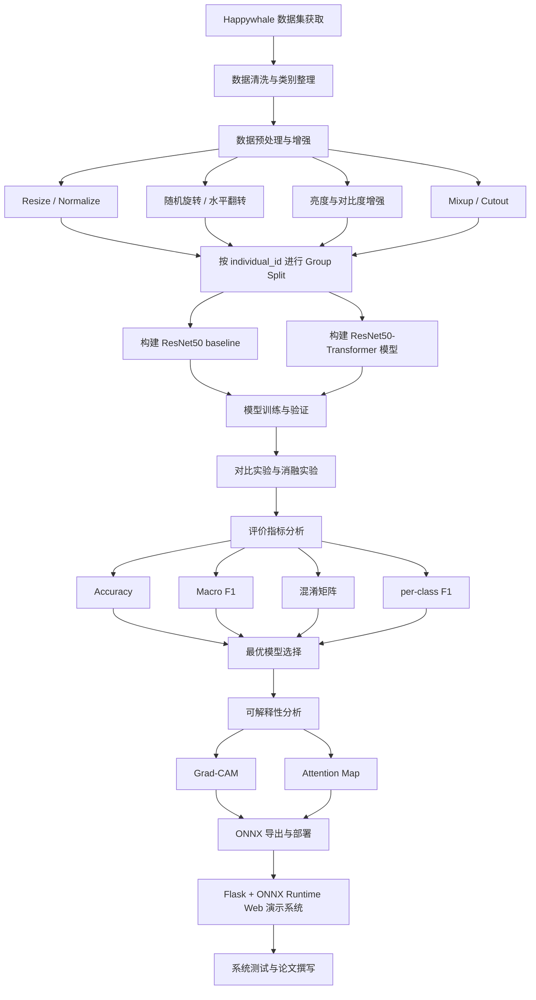
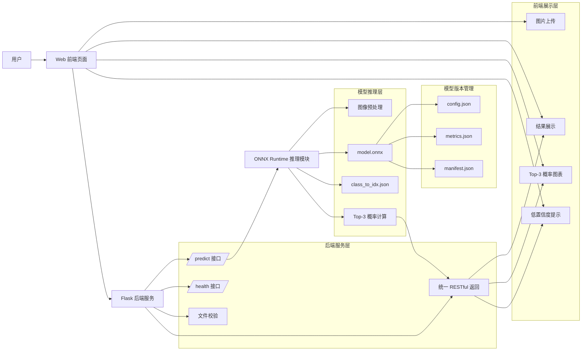
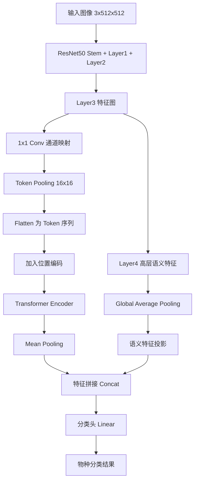
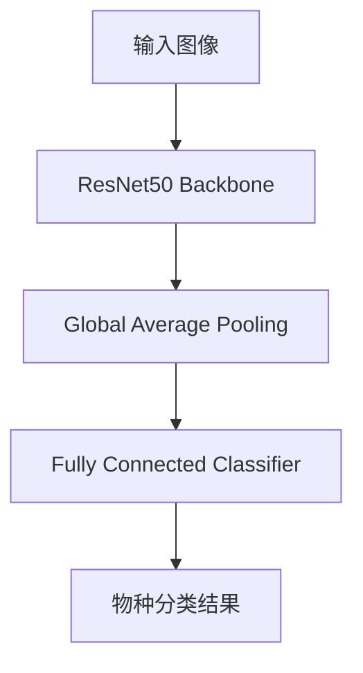
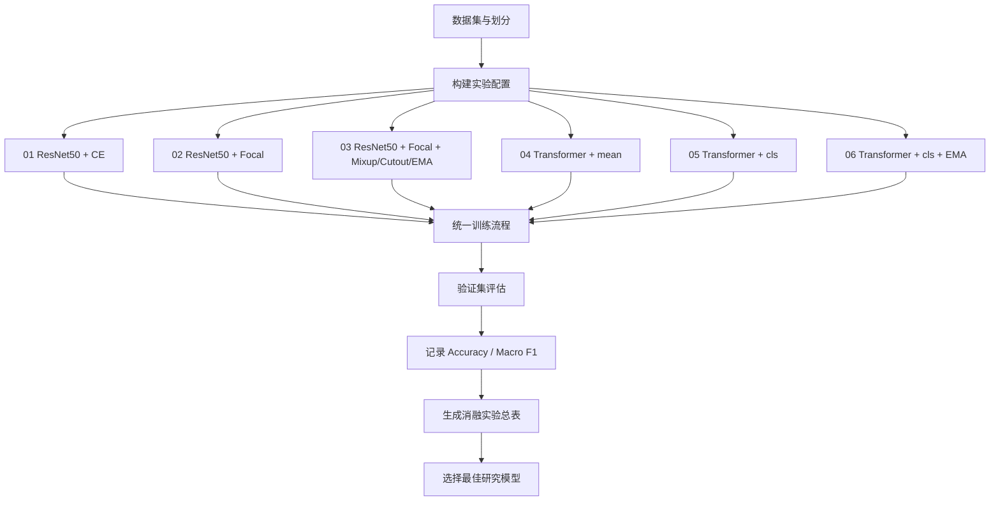
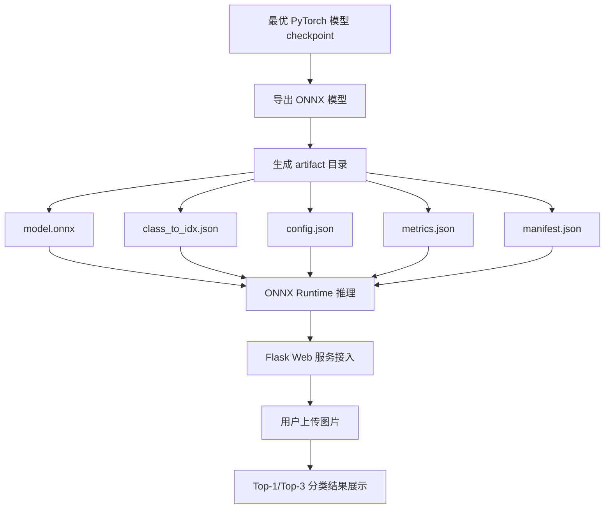
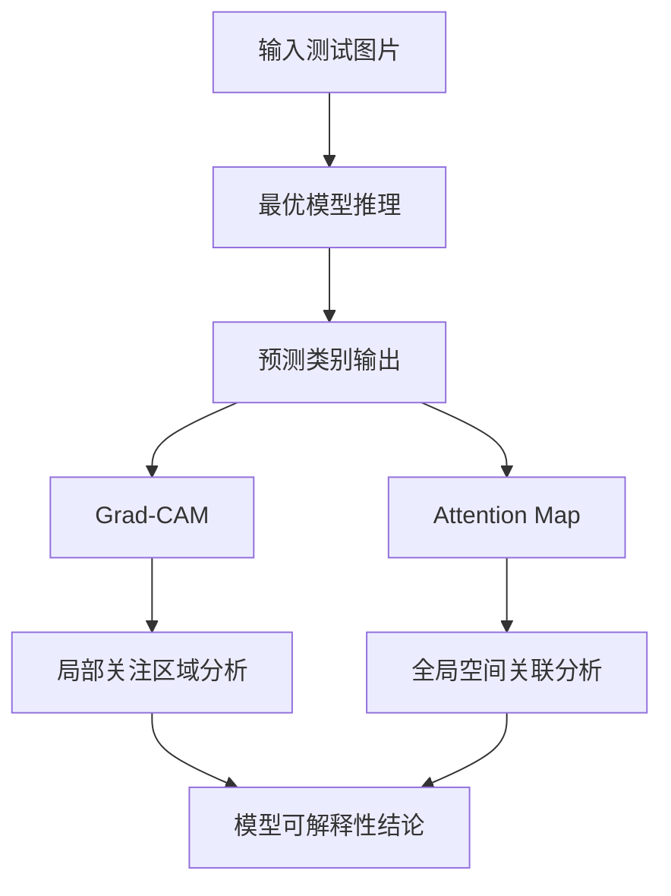

# 论文用 Mermaid 图示代码

本文件整理毕业论文中常用的 Mermaid 图示代码，便于直接复制使用或作为 ProcessOn / draw.io 绘图参考。

建议用途：

- 技术路线图
- 系统架构图
- 模型架构图
- 训练与部署流程图

---

## 1. 技术路线图

---

## 2. 系统总体架构图

---

## 3. ResNet50-Transformer 模型架构图

---

## 4. ResNet50 baseline 对比模型图

---

## 5. 训练与消融实验流程图

---

## 6. ONNX 部署流程图

---

## 7. 可解释性分析流程图

---

## 8. 写论文时的使用建议

1. 第三章可使用“技术路线图”与“训练与消融实验流程图”。
2. 第四章可使用“ResNet50-Transformer 模型架构图”与“ResNet50 baseline 对比模型图”。
3. 第六章可使用“系统总体架构图”与“ONNX 部署流程图”。
4. 第五章可在可解释性分析部分使用“可解释性分析流程图”。
